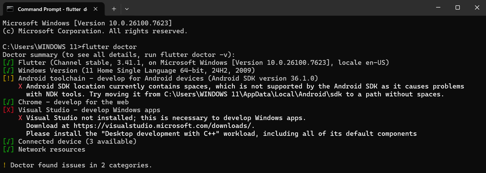

# Laporan Praktikum #01 - Pengantar Pemrograman Mobile

| Atribut | Keterangan                  |
| ------- | ----------                  |
| Nama    | Primayunita Putri Agustine  |
| NIM     | 244107060094                |
| Kelas   | SIB-2E                      |

---

### Hasil Flutter Doctor

Berikut adalah hasil dari perintah `flutter doctor -v` yang menunjukkan bahwa semua komponen telah terinstal dan terkonfigurasi dengan baik:

