# Laporan Praktikum #11 - Pemrograman Asynchronous

## Identitas Mahasiswa

| Atribut | Nilai                       |
| ------- | -----                       |
| Nama    | Primayunita Putri Agustine  |
| NIM     | 244107060094                |
| Kelas   | SIB-2E                      |

[LINK REPOSITORY KODE PRAKTIKUM](https://github.com/Primayunita/src-week-11.git)

---

## Praktikum 1: Mengunduh Data dari Web Service (API)

### Langkah 1: Buat Project Baru

Buatlah sebuah project flutter baru dengan nama books di folder src week-11 repository GitHub Anda.

.png)

Kemudian Tambahkan dependensi http dengan mengetik perintah berikut di terminal.

.png)

### Langkah 2: Cek file pubspec.yaml

Jika berhasil install plugin, pastikan plugin http telah ada di file pubspec ini seperti berikut.

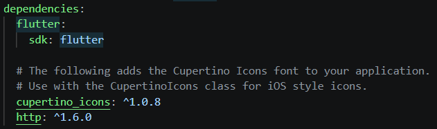

### Buka file main.dart

Ketiklah kode seperti berikut ini.

#### Soal 1

Tambahkan nama panggilan Anda pada title app sebagai identitas hasil pekerjaan Anda.

```dart
import 'dart:async';
import 'package:flutter/material.dart';
import 'package:http/http.dart';
import 'package:http/http.dart' as http;

void main() {
  runApp(const MyApp());
}

class MyApp extends StatelessWidget {
  const MyApp({super.key});

  @override
  Widget build(BuildContext context) {
    return MaterialApp(
      title: 'Future Demo Nita',
      theme: ThemeData(
        primarySwatch: Colors.blue,
        visualDensity: VisualDensity.adaptivePlatformDensity,
      ),
      home: const FuturePage(),
    );
  }
}

class FuturePage extends StatefulWidget {
  const FuturePage({super.key});

  @override
  State<FuturePage> createState() => _FuturePageState();
}

class _FuturePageState extends State<FuturePage> {
  String result = '';
  @override
  Widget build(BuildContext context) {
    return Scaffold(
      appBar: AppBar(
        title: const Text('Back from the Future'),
      ),
      body: Center(
        child: Column(children: [
          const Spacer(),
          ElevatedButton(
            child: const Text('GO!'),
            onPressed: () {},
          ),
          const Spacer(),
          Text(result),
          const Spacer(),
          const CircularProgressIndicator(),
          const Spacer(),
        ]),
      ),
    );
  }
}
```

### Langkah 4: Tambah method getData()

Tambahkan method ini ke dalam class _FuturePageState yang berguna untuk mengambil data dari API Google Books.

```dart
Future<Response> getData() async {
    const authority = 'www.googleapis.com';
    const path = '/books/v1/volumes/B4_iEAAAQBAJ';
    Uri url = Uri.https(authority, path);
    return http.get(url);
  }
```

#### Soal 2

- Carilah judul buku favorit Anda di Google Books, lalu ganti ID buku pada variabel path di kode tersebut. Caranya ambil di URL browser Anda seperti gambar berikut ini.

.png)

- Kemudian cobalah akses di browser URI tersebut dengan lengkap seperti ini. Jika menampilkan data JSON, maka Anda telah berhasil. Lakukan capture milik Anda dan tulis di README pada laporan praktikum. Lalu lakukan commit dengan pesan "W11: Soal 2".

.png)

.png)

### Langkah 5: Tambah kode di ElevatedButton

Tambahkan kode pada onPressed di ElevatedButton seperti berikut.

```dart
ElevatedButton(
  child: const Text('GO!'),
  onPressed: () {
    setState(() {});

    getData()
        .then((value) {
          result = value.body.toString().substring(0, 450);

          setState(() {});
        })
        .catchError((_) {
          result = 'An error occurred';

          setState(() {});
        });
  },
),
```

Lakukan run aplikasi Flutter Anda. Anda akan melihat tampilan akhir seperti gambar berikut. Jika masih terdapat error, silakan diperbaiki hingga bisa running.

#### Soal 3

- Jelaskan maksud kode langkah 5 tersebut terkait substring dan catchError!

*Jawab:*

substring() digunakan untuk membatasi jumlah teks hasil API yang ditampilkan agar lebih ringkas, sedangkan catchError() berfungsi menangani kesalahan saat proses request data sehingga aplikasi tidak error dan tetap dapat menampilkan pesan kesalahan kepada pengguna.

- Capture hasil praktikum Anda berupa GIF dan lampirkan di README. Lalu lakukan commit dengan pesan "W11: Soal 3".

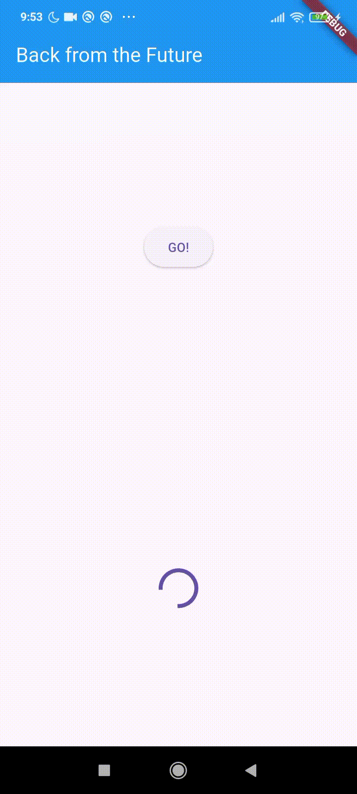

---

## Praktikum 2: Menggunakan await/async untuk menghindari callbacks

### Langkah 1: Buka file main.dart

Tambahkan tiga method berisi kode seperti berikut di dalam class _FuturePageState.

```dart
Future<int> returnOneAsync() async {
  await Future.delayed(const Duration(seconds: 3));
  return 1;
}

Future<int> returnTwoAsync() async {
  await Future.delayed(const Duration(seconds: 3));
  return 2;
}

Future<int> returnThreeAsync() async {
  await Future.delayed(const Duration(seconds: 3));
  return 3;
}
```

### Langkah 2: Tambah method count()

Lalu tambahkan lagi method ini di bawah ketiga method sebelumnya.

```dart
Future count() async {
  int total = 0;
  total = await returnOneAsync();
  total += await returnTwoAsync();
  total += await returnThreeAsync();
  setState(() {
    result = total.toString();
  });
}
```

### Langkah 3: Panggil count()

Lakukan comment kode sebelumnya, ubah isi kode onPressed() menjadi seperti berikut.

```dart
ElevatedButton(
              child: const Text('GO!'),
              onPressed: () {
                count();
              },
            ),
```

### Langkah 4: Run

Akhirnya, run atau tekan F5 jika aplikasi belum running. Maka Anda akan melihat seperti gambar berikut, hasil angka 6 akan tampil setelah delay 9 detik.

#### Soal 4

- Jelaskan maksud kode langkah 1 dan 2 tersebut!

*Jawab:*

Langkah 1 bertujuan membuat tiga fungsi asynchronous (returnOneAsync, returnTwoAsync, dan returnThreeAsync) yang memberi jeda 3 detik lalu mengembalikan nilai 1, 2, dan 3. Method ini digunakan untuk simulasi proses async.

Langkah 2 membuat method count() untuk menjalankan ketiga method tersebut, menjumlahkan hasilnya, lalu menampilkan hasil ke layar menggunakan setState().

- Capture hasil praktikum Anda berupa GIF dan lampirkan di README. Lalu lakukan commit dengan pesan "W11: Soal 4".

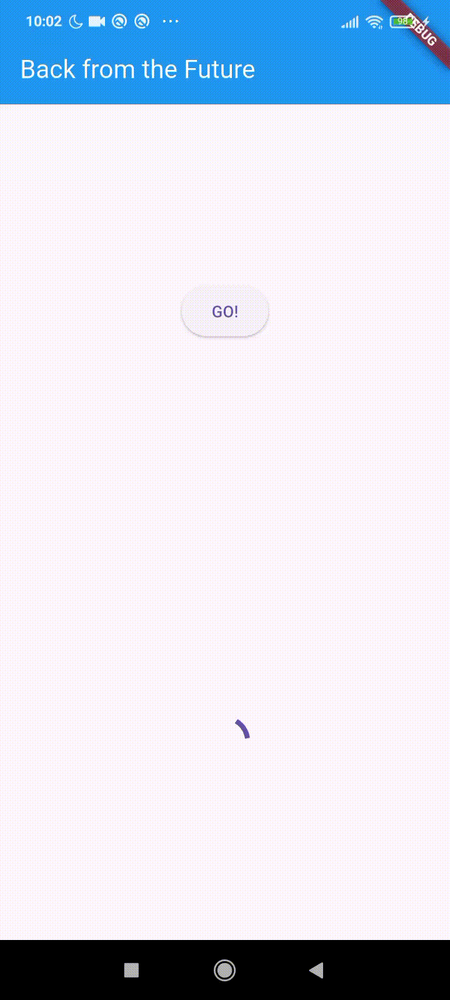

---

## Praktikum 3: Menggunakan Completer di Future

### Langkah 1: Buka main.dart

Pastikan telah impor package async berikut.

```dart
import 'package:async/async.dart';
```

### Langkah 2: Tambahkan variabel dan method

Tambahkan variabel late dan method di class _FuturePageState seperti ini.

```dart
late Completer completer;

Future getNumber() {
  completer = Completer<int>();
  calculate();
  return completer.future;
}

Future calculate() async {
  await Future.delayed(const Duration(seconds : 5));
  completer.complete(42);
}
```

### Langkah 3: Ganti isi kode onPressed()

Tambahkan kode berikut pada fungsi onPressed(). Kode sebelumnya bisa Anda comment.

```dart
getNumber().then((value) {
  setState(() {
    result = value.toString();
  });
});
```

### Langkah 4: 

Terakhir, run atau tekan F5 untuk melihat hasilnya jika memang belum running. Bisa juga lakukan hot restart jika aplikasi sudah running. Maka hasilnya akan seperti gambar berikut ini. Setelah 5 detik, maka angka 42 akan tampil.


#### Soal 5

- Jelaskan maksud kode langkah 2 tersebut!

*Jawab:*

Kode tersebut digunakan untuk mengatur proses asynchronous dengan Completer, sehingga program dapat menunggu beberapa detik sebelum mengirim hasil berupa nilai 42 ke method getNumber().

- Capture hasil praktikum Anda berupa GIF dan lampirkan di README. Lalu lakukan commit dengan pesan "W11: Soal 5".

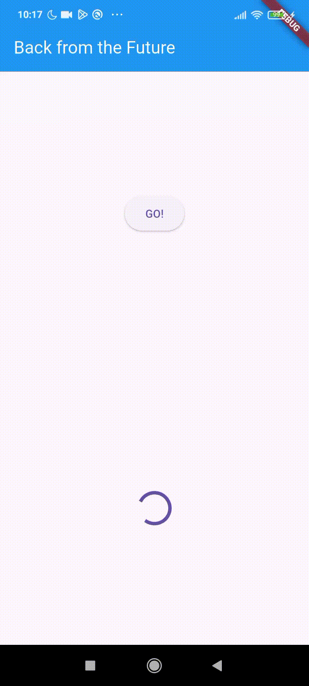

### Langkah 5: Ganti method calculate()

Gantilah isi code method calculate() seperti kode berikut, atau Anda dapat membuat calculate2()

```dart
calculate() async {
  try {
    await new Future.delayed(const Duration(seconds : 5));
    completer.complete(42);
//  throw Exception();
  }
  catch (_) {
    completer.completeError({});
  }
}
```

### Langkah 6: Pindah ke onPressed()

Ganti menjadi kode seperti berikut.

```dart
getNumber().then((value) {
  setState(() {
    result = value.toString();
  });
}).catchError((e) {
  result = 'An error occurred';
});
```

#### Soal 6

- Jelaskan maksud perbedaan kode langkah 2 dengan langkah 5-6 tersebut!

*Jawab:*

Langkah 2 kode hanya digunakan untuk menjalankan proses asynchronous dan mengembalikan nilai 42 setelah beberapa detik. Sedangkan pada langkah 5–6 ditambahkan penanganan error menggunakan try-catch, completeError(), dan catchError() sehingga aplikasi dapat menangani kesalahan dengan lebih aman dan menampilkan pesan error jika terjadi masalah.

- Capture hasil praktikum Anda berupa GIF dan lampirkan di README. Lalu lakukan commit dengan pesan "W11: Soal 6"

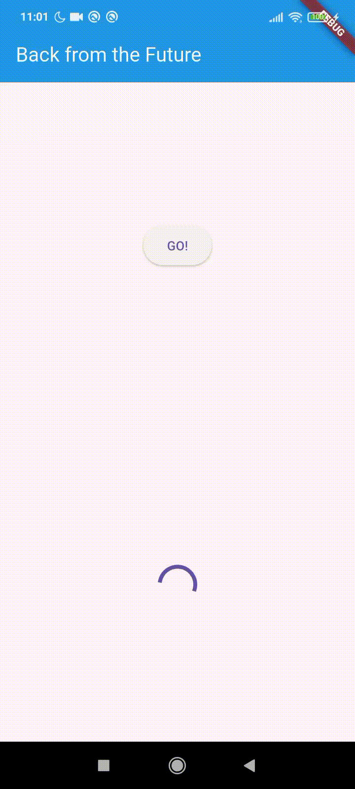

---

## Praktikum 4: Memanggil Future secara paralel

### Langkah 1: Buka file main.dart

Tambahkan method ini ke dalam class _FuturePageState

```dart
void returnFG() {
  FutureGroup<int> futureGroup = FutureGroup<int>();
  futureGroup.add(returnOneAsync());
  futureGroup.add(returnTwoAsync());
  futureGroup.add(returnThreeAsync());
  futureGroup.close();
  
  futureGroup.future.then((List <int> value) {
    int total = 0;
    for (var element in value) {
      total += element;
    }
    setState(() {
      result = total.toString();
    });
  });
}
```

### Langkah 2: Edit onPressed()

Anda bisa hapus atau comment kode sebelumnya, kemudian panggil method dari langkah 1 tersebut.

```dart
onPressed: () {
  returnFG();
}
```

### Langkah 3: Run

Anda akan melihat hasilnya dalam 3 detik berupa angka 6 lebih cepat dibandingkan praktikum sebelumnya menunggu sampai 9 detik.

#### Soal 7

- Capture hasil praktikum Anda berupa GIF dan lampirkan di README. Lalu lakukan commit dengan pesan "W11: Soal 7".

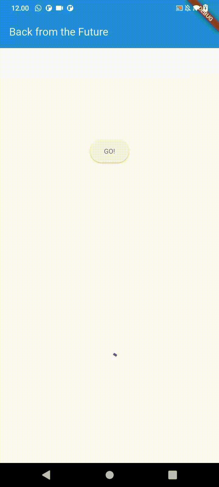

### Langkah 4: Ganti variabel futureGroup

Anda dapat menggunakan FutureGroup dengan Future.wait seperti kode berikut.

```dart
final futures = Future.wait<int>([
  returnOneAsync(),
  returnTwoAsync(),
  returnThreeAsync(),
]);
```

#### Soal 8

- Jelaskan maksud perbedaan kode langkah 1 dan 4!

*Jawab:*

Pada langkah 1 digunakan FutureGroup dari package async, sehingga Future harus ditambahkan satu per satu menggunakan add() dan ditutup dengan close(). Sedangkan pada langkah 4 digunakan Future.wait() yang merupakan fitur bawaan Dart, sehingga beberapa Future dapat langsung dimasukkan ke dalam list dengan penulisan yang lebih singkat, sederhana, dan praktis.

---

## Praktikum 5: Menangani Respon Error pada Async Code

### Langkah 1: Buka file main.dart

Tambahkan method ini ke dalam class _FuturePageState

```dart
Future returnError() async {
  await Future.delayed(const Duration(seconds: 2));
  throw Exception('Something terrible happened!');
}
```

### Langkah 2: ElevatedButton

Ganti dengan kode berikut

```dart
returnError()
    .then((value) {
      setState(() {
        result = 'Success';
      });
    }).catchError((onError) {
      setState(() {
        result = onError.toString();
      });
    }).whenComplete(() => print('Complete'));
```

### Langkah 3: Run

Lakukan run dan klik tombol GO! maka akan menghasilkan seperti gambar berikut.

.jpeg)

Pada bagian debug console akan melihat teks Complete seperti berikut.

.png)

#### Soal 9

- Capture hasil praktikum Anda berupa GIF dan lampirkan di README. Lalu lakukan commit dengan pesan "W11: Soal 9".

.gif)

### Langkah 4: Tambah method handleError()

Tambahkan kode ini di dalam class _FutureStatePage

```dart
Future handleError() async {
  try {
    await returnError();
  }
  catch (error) {
    setState(() {
      result = error.toString();
    });
  }
  finally {
    print('Complete');
  }
}
```

#### Soal 10

- Panggil method handleError() tersebut di ElevatedButton, lalu run. Apa hasilnya? Jelaskan perbedaan kode langkah 1 dan 4!

*Jawab:*

Hasil saat method handleError() dipanggil pada ElevatedButton adalah aplikasi akan menampilkan pesan error : 

```dart
Exception: Something terrible happened!
```

-Pada langkah 1, method returnError() hanya digunakan untuk menghasilkan error dengan throw Exception.
-Pada langkah 4, method handleError() digunakan untuk menangani error tersebut menggunakan try-catch-finally, sehingga error bisa ditampilkan ke variabel result tanpa membuat aplikasi berhenti. Bagian finally akan tetap dijalankan untuk menampilkan pesan Complete.

---

## Praktikum 6: Menggunakan Future dengan StatefulWidget

### Langkah 1: install plugin geolocator

Tambahkan plugin geolocator dengan mengetik perintah berikut di terminal.

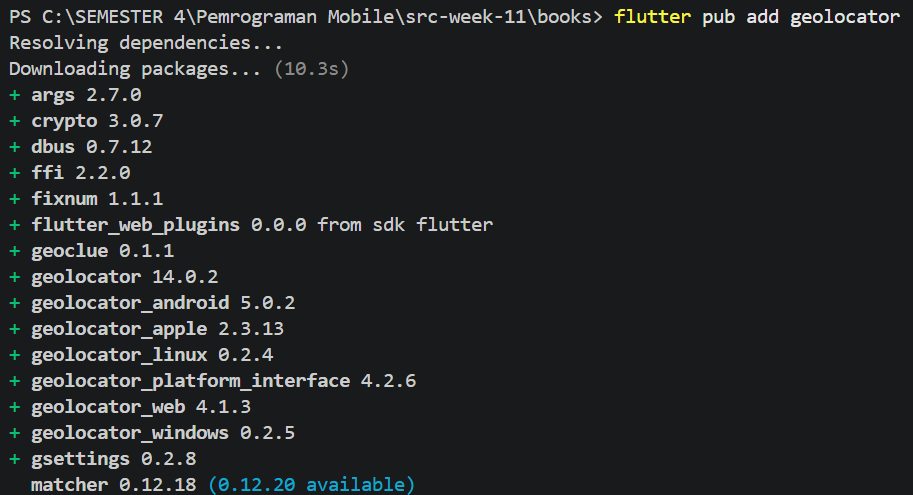

### Langkah 2: Tambah permission GPS

Jika Anda menargetkan untuk platform Android, maka tambahkan baris kode berikut di file

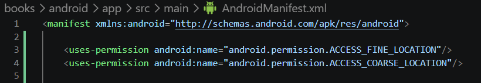

### Langkah 3: Buat file geolocation.dart

Buat file geolocation.dart

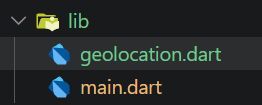

### Langkah 4: Buat StatefulWidget

Buat class LocationScreen di dalam file geolocation.dart

```dart
import 'package:flutter/material.dart';

class LocationScreen extends StatefulWidget {
  const LocationScreen({super.key});

  @override
  State<LocationScreen> createState() => _LocationScreenState();
}

class _LocationScreenState extends State<LocationScreen> {
  String myPosition = '';
  @override
  Widget build(BuildContext context) {
    return Scaffold(
      appBar: AppBar(title: const Text('Current Location')),
      body: Center(child: Text(myPosition)),
    );
  }
}
```

### Langkah 5: Isi kode geolocation.dart

```dart
import 'package:flutter/material.dart';
import 'package:geolocator/geolocator.dart';

class LocationScreen extends StatefulWidget {
  const LocationScreen({super.key});

  @override
  State<LocationScreen> createState() => _LocationScreenState();
}

class _LocationScreenState extends State<LocationScreen> {
  String myPosition = '';

  @override
  void initState() {
    super.initState();
    getPosition().then((Position myPos) {
      myPosition =
          'Latitude: ${myPos.latitude.toString()} - Longitude: ${myPos.longitude.toString()}';
      setState(() {
        myPosition = myPosition;
      });
    });
  }

  @override
  Widget build(BuildContext context) {
    return Scaffold(
      appBar: AppBar(title: const Text('Current Location')),
      body: Center(child: Text(myPosition)),
    );
  }

  Future<Position> getPosition() async {
    await Geolocator.requestPermission();
    await Geolocator.isLocationServiceEnabled();
    Position? position =
        await Geolocator.getCurrentPosition();
    return position;
  }
}
```

#### Soal 11

- Tambahkan nama panggilan Anda pada tiap properti title sebagai identitas pekerjaan Anda.

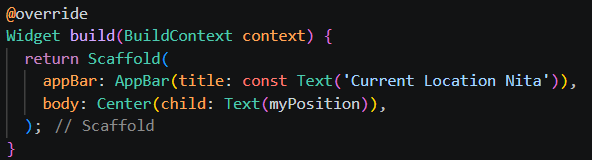

### Langkah 6: Edit main.dart

Panggil screen baru tersebut di file main Anda seperti berikut.

```dart
home: LocationScreen(),
```

### Langkah 7: Run

Run project Anda di device atau emulator (bukan browser), maka akan tampil seperti berikut ini.

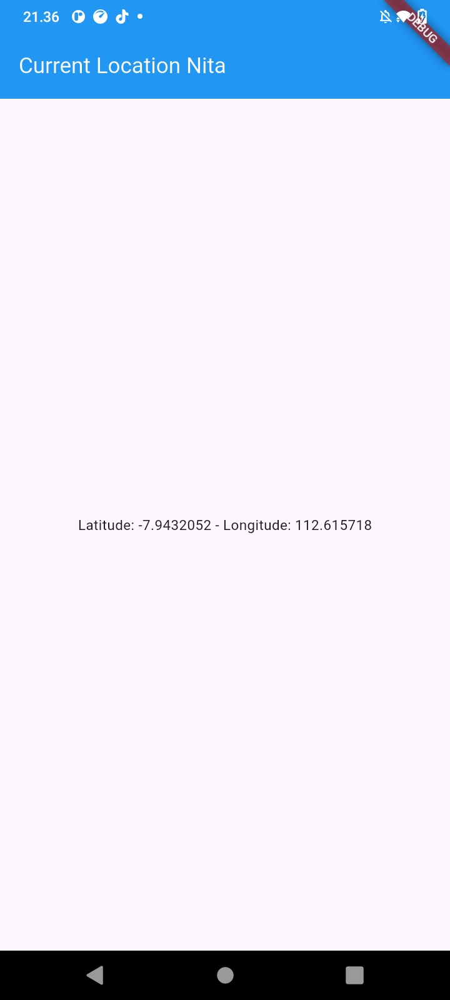

### Langkah 8: Tambahkan animasi loading

Tambahkan widget loading seperti kode berikut. Lalu hot restart, perhatikan perubahannya.

```dart
@override
Widget build(BuildContext context) {
  final myWidget = myPosition == ''
      ? const CircularProgressIndicator()
      : const Text(myPosition);;

  return Scaffold(
    appBar: AppBar(title: Text('Current Location')),
    body: Center(child: myWidget),
  );
}
```

#### Soal 12

- Jika Anda tidak melihat animasi loading tampil, kemungkinan itu berjalan sangat cepat. Tambahkan delay pada method getPosition() dengan kode await Future.delayed(const Duration(seconds: 3));

- Apakah Anda mendapatkan koordinat GPS ketika run di browser? Mengapa demikian?

*Jawab:*

Saat dijalankan di browser, koordinat GPS kurang akurat karena browser tidak memakai GPS langsung seperti di Android. Browser menggunakan izin lokasi dan jaringan internet/WiFi untuk menentukan lokasi pengguna.

- Capture hasil praktikum Anda berupa GIF dan lampirkan di README. Lalu lakukan commit dengan pesan "W11: Soal 12".

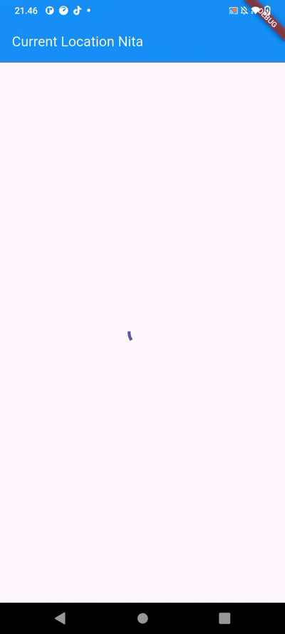

---

## Praktikum 7: Manajemen Future dengan FutureBuilder

### Langkah 1: Modifikasi method getPosition()

Buka file geolocation.dart kemudian ganti isi method dengan kode ini.

```dart
Future<Position> getPosition() async {
  await Geolocator.isLocationServiceEnabled();
  await Future.delayed(const Duration(seconds: 3));
  Position position = await Geolocator.getCurrentPosition();
  return position;
}
```

### Langkah 2: Tambah variabel

Tambah variabel ini di class _LocationScreenState

```dart
Future<Position>? position;
```

### Langkah 3: Tambah initState()

Tambah method ini dan set variabel position

```dart
@override
void initState() {
  super.initState();
  position = getPosition();
}
```

### Langkah 4: Edit method build()

Ketik kode berikut dan sesuaikan. Kode lama bisa Anda comment atau hapus.

```dart
@override
Widget build(BuildContext context) {
  return Scaffold(
    appBar: AppBar(title: Text('Current Location')),
    body: Center(child: FutureBuilder(
      future: position,
      builder: (BuildContext context, AsyncSnapshot<Position>
      snapshot) {
        if (snapshot.connectionState ==
        ConnectionState.waiting) {
          return const CircularProgressIndicator();
        }
        else if (snapshot.connectionState ==
        ConnectionState.done) {
          return Text(snapshot.data.toString());
        }
        else {
          return const Text('');
        }
      },
    ),
  ));
}
```

#### Soal 13

- Apakah ada perbedaan UI dengan praktikum sebelumnya? Mengapa demikian?

*Jawab:*

Iya, terdapat perbedaan UI dengan praktikum sebelumnya. Pada praktikum sebelumnya muncul loading (CircularProgressIndicator) sebelum lokasi ditampilkan, sedangkan pada praktikum sekarang data latitude dan longitude tampil lebih cepat setelah proses selesai. Hal ini karena FutureBuilder menampilkan loading saat ConnectionState.waiting, lalu menggantinya dengan data saat ConnectionState.done. Selain itu, delay 3 detik dihapus dan akurasi lokasi diubah menjadi LocationAccuracy.low sehingga proses lebih cepat.

- Capture hasil praktikum Anda berupa GIF dan lampirkan di README. Lalu lakukan commit dengan pesan "W11: Soal 13".

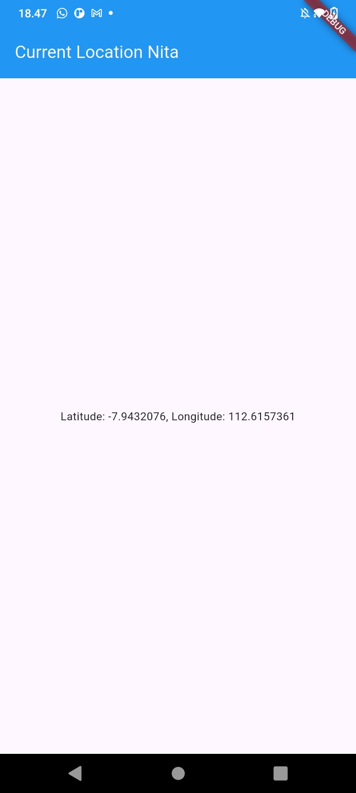

- Seperti yang Anda lihat, menggunakan FutureBuilder lebih efisien, clean, dan reactive dengan Future bersama UI.

### Langkah 5: Tambah handling error

Tambahkan kode berikut untuk menangani ketika terjadi error. Kemudian hot restart.

```dart
else if (snapshot.connectionState == ConnectionState.done) {
  if (snapshot.hasError) {
     return Text('Something terrible happened!');
  }
  return Text(snapshot.data.toString());
}
```

#### Soal 14

- Apakah ada perbedaan UI dengan langkah sebelumnya? Mengapa demikian?

*Jawab:*

Iya, terdapat perbedaan UI dengan langkah sebelumnya. Pada langkah ini, aplikasi dapat menampilkan pesan error "Something terrible happened!" ketika terjadi masalah saat mengambil lokasi. Sebelumnya, aplikasi hanya menampilkan loading atau data lokasi tanpa penanganan error. Hal ini terjadi karena ditambahkan kondisi snapshot.hasError pada FutureBuilder untuk menangani error agar aplikasi lebih aman dan informatif bagi pengguna.

- Capture hasil praktikum Anda berupa GIF dan lampirkan di README. Lalu lakukan commit dengan pesan "W11: Soal 14".

Hasil run saat GPS aktif

.gif)

Hasil run saat GPS nonaktif

.gif)

---

## Praktikum 8: Navigation route dengan Future Function

### Langkah 1: Buat file baru navigation_first.dart

Buatlah file baru ini di project lib Anda.

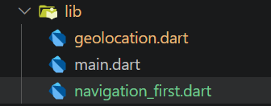

### Langkah 2: Isi kode navigation_first.dart

```dart
import 'package:flutter/material.dart';

class NavigationFirst extends StatefulWidget {
  const NavigationFirst({super.key});

  @override
  State<NavigationFirst> createState() => _NavigationFirstState();
}

class _NavigationFirstState extends State<NavigationFirst> {
  Color color = Colors.pink.shade300;

  @override
  Widget build(BuildContext context) {
    return Scaffold(
      backgroundColor: color,
      appBar: AppBar(
        backgroundColor: Colors.pink,
        foregroundColor: Colors.white,
        title: const Text('Navigation First Screen Nita'),
      ),
      body: Center(
        child: ElevatedButton(
          child: const Text('Change Color'),
          onPressed: () {
            _navigateAndGetColor(context);
          },
        ),
      ),
    );
  }
}
```

#### Soal 15

- Tambahkan nama panggilan Anda pada tiap properti title sebagai identitas pekerjaan Anda.

```dart
title: const Text('Navigation First Screen Nita')
```

- Silakan ganti dengan warna tema favorit Anda.

```dart
backgroundColor: color,
      appBar: AppBar(
        backgroundColor: Colors.pink,
        foregroundColor: Colors.white,
      )
```

### Langkah 3: Tambah method di class _NavigationFirstState

Tambahkan method ini.

```dart
Future _navigateAndGetColor(BuildContext context) async {
    color =
        await Navigator.push(
          context,
          MaterialPageRoute(
            builder: (context) => const NavigationSecond(),
          ),
        ) ??
        Colors.pink;

    setState(() {});
  }
```

### Langkah 4: Buat file baru navigation_second.dart

Buat file baru ini di project lib Anda. Silakan jika ingin mengelompokkan view menjadi satu folder dan sesuaikan impor yang dibutuhkan.

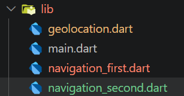

### Langkah 5: Buat class NavigationSecond dengan StatefulWidget

```dart
import 'package:flutter/material.dart';

class NavigationSecond extends StatefulWidget {
  const NavigationSecond({super.key});

  @override
  State<NavigationSecond> createState() =>
      _NavigationSecondState();
}

class _NavigationSecondState
    extends State<NavigationSecond> {
  @override
  Widget build(BuildContext context) {
    Color color;

    return Scaffold(
      appBar: AppBar(
        backgroundColor: Colors.pink,
        foregroundColor: Colors.white,
        title: const Text(
          'Navigation Second Screen Nita',
        ),
      ),
      body: Center(
        child: Column(
          mainAxisAlignment:
              MainAxisAlignment.spaceEvenly,
          children: [
            ElevatedButton(
              child: const Text('Pink'),
              onPressed: () {
                color = Colors.pink.shade300;
                Navigator.pop(context, color);
              },
            ),
            ElevatedButton(
              child: const Text('Purple'),
              onPressed: () {
                color = Colors.purple.shade300;
                Navigator.pop(context, color);
              },
            ),
            ElevatedButton(
              child: const Text('Rose'),
              onPressed: () {
                color = Colors.pink.shade700;
                Navigator.pop(context, color);
              },
            ),
          ],
        ),
      ),
    );
  }
}
```

### Langkah 6: Edit main.dart

```dart
home: const NavigationFirst(),
```

### Langkah 8: Run

Lakukan run, jika terjadi error silakan diperbaiki.

#### Soal 16

- Cobalah klik setiap button, apa yang terjadi ? Mengapa demikian ?

*Jawab:*

Saat setiap button ditekan, aplikasi akan berpindah dari Navigation First Screen ke Navigation Second Screen, kemudian warna background pada screen pertama berubah sesuai tombol warna yang dipilih.

Hal ini terjadi karena setiap button pada NavigationSecond menjalankan:

```dart
Navigator.pop(context, color);
```

Kode tersebut mengirim nilai warna kembali ke NavigationFirst. Setelah itu, method _navigateAndGetColor() menerima warna tersebut dan menjalankan setState() sehingga tampilan background berubah secara langsung.

- Gantilah 3 warna pada langkah 5 dengan warna favorit Anda!

- Capture hasil praktikum Anda berupa GIF dan lampirkan di README. Lalu lakukan commit dengan pesan "W11: Soal 16".


---

## Praktikum 9: Memanfaatkan async/await dengan Widget Dialog

### Langkah 1: Buat file baru navigation_dialog.dart

Buat file dart baru di folder lib project Anda.

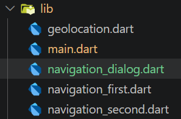

### Langkah 2: Isi kode navigation_dialog.dart

```dart
import 'package:flutter/material.dart';

class NavigationDialogScreen extends StatefulWidget {
  const NavigationDialogScreen ({super.key});

  @override
  State<NavigationDialogScreen> createState() => _NavigationDialogScreenState();
}

class _NavigationDialogScreenState extends State<NavigationDialogScreen> {
  Color color = Colors.blue.shade700;
  
  @override
  Widget build(BuildContext context) {
    return Scaffold(
      backgroundColor: color,
      appBar: AppBar(
        title: const Text('Navigation Dialog Screen'),
      ),
      body: Center(
        child:
            ElevatedButton(child: const Text('Change Color'),
        onPressed: () {}),
      ),
    );
  }
}
```

### Langkah 3:  Tambah method async

```dart
_showColorDialog(BuildContext context) async {
    await showDialog(
      barrierDismissible: false,
      context: context,
      builder: (_) {
        return AlertDialog(
          title: const Text('Very important question'),
          content: const Text(
            'Please choose a color',
          ),
          actions: <Widget>[
            TextButton(
              child: const Text('Pink'),
              onPressed: () {
                color = Colors.pink.shade300;
                Navigator.pop(context, color);
              },
            ),
            TextButton(
              child: const Text('Purple'),
              onPressed: () {
                color = Colors.purple.shade300;
                Navigator.pop(context, color);
              },
            ),
            TextButton(
              child: const Text('Rose'),
              onPressed: () {
                color = Colors.pink.shade700;
                Navigator.pop(context, color);
              },
            ),
          ],
        );
      },
    );

    setState(() {});
  }
```

### Langkah 4: Panggil method di ElevatedButton

```dart
onPressed: () {
  _showColorDialog(context);
}),
```

### Langkah 5: Edit main.dart

Ubah properti home

```dart
home: const NavigationDialogScreen(),
```

### Langkah 6: Run

Coba ganti warna background dengan widget dialog tersebut. Jika terjadi error, silakan diperbaiki. Jika berhasil, akan tampil seperti gambar berikut.

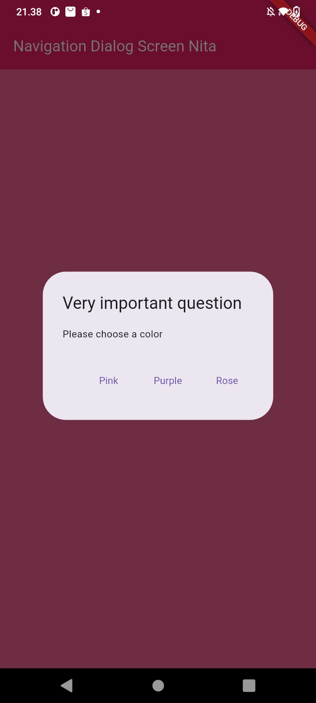

#### Soal 17

- Cobalah klik setiap button, apa yang terjadi ? Mengapa demikian ?

*Jawab:*

Saat setiap button pada dialog ditekan, warna background aplikasi akan berubah sesuai warna yang dipilih, seperti pink, purple, atau rose. Hal ini terjadi karena setiap button mengubah nilai variabel color, kemudian setState() dijalankan sehingga tampilan aplikasi diperbarui secara otomatis.

- Gantilah 3 warna pada langkah 3 dengan warna favorit Anda!

- Capture hasil praktikum Anda berupa GIF dan lampirkan di README. Lalu lakukan commit dengan pesan "W11: Soal 17".


---