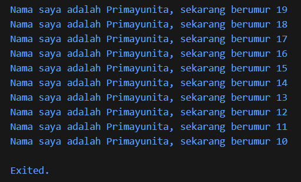

# Laporan Praktikum #02 - Pemrograman Dasar Dart - Bag.1 (Variabel dan Tipe Data)

| Atribut | Keterangan                  |
| ------- | ----------                  |
| Nama    | Primayunita Putri Agustine  |
| NIM     | 244107060094                |
| Kelas   | SIB-2E                      |

---

## Soal 1 

Modifikasilah kode pada baris 3 di VS Code atau Editor Code favorit Anda berikut ini agar mendapatkan keluaran (output) sesuai yang diminta!

```dart
void main() {
  for (int i = 0; i < 10; i++) {
    print("Hello ${i + 2}");
  }
}
```

## Jawaban:

```dart
void main() {
  for (int i = 0; i < 10; i++) {
    print('Nama saya adalah Primayunita, sekarang berumur ${19 - i}');
  }
}
```


---

## Soal 2

Mengapa sangat penting untuk memahami bahasa pemrograman Dart sebelum kita menggunakan framework Flutter ? Jelaskan!

## Jawaban:

Memahami bahasa pemrograman Dart sebelum menggunakan Flutter itu sangat penting karena Flutter sendiri menggunakan Dart sebagai bahasa utamanya. Jadi semua kode yang kita tulis di Flutter sebenarnya adalah kode Dart. Kalau kita belum paham dasar-dasar Dart seperti variabel, function, class, dan konsep OOP, kita akan kesulitan saat membuat widget atau mengatur logika program di Flutter.

--- 

## Soal 3

Rangkumlah materi dari codelab ini menjadi poin-poin penting yang dapat Anda gunakan untuk membantu proses pengembangan aplikasi mobile menggunakan framework Flutter.

## Jawaban: 

**Rangkuman Materi Codelab Dart untuk Pengembangan Flutter**

**1. Pengenalan Dart**
Dart adalah bahasa pemrograman tingkat tinggi yang menjadi dasar dari framework Flutter. Bahasa ini dikembangkan untuk membuat pengembangan aplikasi menjadi lebih modern, cepat, dan fleksibel. Semua kode Flutter ditulis menggunakan Dart, sehingga memahami Dart sangat penting sebelum menggunakan Flutter. 

**2. Kelebihan Dart** 
Bahasa Dart memiliki beberapa fitur unggulan :
* Productive tooling: dukungan IDE lengkap dan ekosistem paket yang kuat.
* Garbage collection: manajemen memori otomatis.
* Type annotations & statically typed: membantu menemukan bug sejak kompilasi.
* Portability: bisa dikompilasi ke native maupun web.

**3. Cara Kerja Dart**
Kode Dart bisa dijalankan dengan dua cara utama:
* Dart VM: Digunakan saat development (mendukung debugging dan hot reload).
* Kompilasi ke JavaScript: Untuk aplikasi web.
Dart juga memiliki dua metode kompilasi:
* JIT (Just-In-Time): Digunakan saat pengembangan, mendukung hot reload.
* AOT (Ahead-Of-Time): Digunakan saat aplikasi dirilis, performa lebih cepat.

**4. Konsep Dasar Dart (Sintaks & OOP)**
* Dart mendukung Object Oriented Programming (OOP) seperti class, object, inheritance, dan polymorphism.
* Operator di Dart bekerja sebagai method yang dapat dimodifikasi sesuai kebutuhan.
* Dart memiliki banyak operator seperti aritmatika (+, -, /, *), logika (&&, ||, !), dan relational (==, !=, >, <).
* Setiap nilai di Dart merupakan objek, bahkan tipe dasar seperti angka pun merupakan turunan dari class.

---

## Soal 4

Buatlah penjelasan dan contoh eksekusi kode tentang perbedaan Null Safety dan Late variabel !

## Jawaban:

**1. Null Safety** adalah fitur di Dart yang mencegah variabel memiliki nilai null secara sembarangan. Artinya, jika kita mendeklarasikan variabel dengan tipe tertentu (misalnya String), maka variabel tersebut tidak boleh bernilai null, kecuali kita menambahkan tanda `?`.

Contoh kode tanpa `?` (akan eror)
``` dart
void main() {
  String nama;
  print(nama); 
}
```
Contoh kode menggunakan `?`: 
```dart
void main() {
    String? nama;
    print(nama);
}
```

**2. Late Variable** digunakan jika variabel akan diisi nanti tetapi tidak boleh null saat digunakan.

Contoh kode 
``` dart
void main() {
  late String nama;
  nama = "Primayunita";
  print(nama);
}
```
Variabel tidak langsung diberi nilai saat deklarasi awal, tetapi harus diisi sebelum digunakan.

Contoh kode yang tidak diisi (akan eror)
``` dart
void main() {
  late String nama;
  print(nama); 
}
```
Akan muncul error karena variabel belum diberi nilai.
