# Laporan Praktikum #03 - Pemrograman Dasar Dart - Bag.2 (Percabangan dan Perulangan)

| Atribut | Keterangan                  |
| ------- | ----------                  |
| Nama    | Primayunita Putri Agustine  |
| NIM     | 244107060094                |
| Kelas   | SIB-2E                      |

---

## Tugas Praktikum

### Soal 1
Silakan selesaikan Praktikum 1 sampai 3, lalu dokumentasikan berupa screenshot hasil pekerjaan beserta penjelasannya!

#### Praktikum 1: Menerapkan Control Flows ("if/else") - langkah 1 dan 2

#### Langkah 1:
Ketik atau salin kode program berikut ke dalam fungsi `main()`.
Code: 
```dart
String test = "test2";
if (test == "test1") {
   print("Test1");
} else If (test == "test2") {
   print("Test2");
} Else {
   print("Something else");
}

if (test == "test2") print("Test2 again"); 
```

#### Langkah 2:
Silahkan coba eksekusi (Run) kode pada langkah 1 tersebut. Apa yang terjadi? Jelaskan!

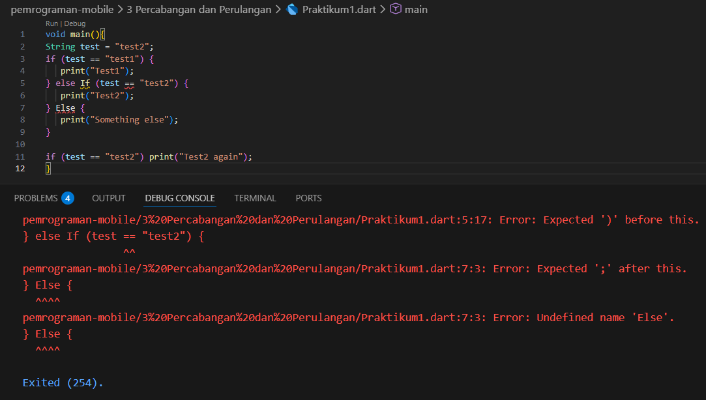

Error terjadi karena penulisan Else If dan Else menggunakan huruf besar. Bahasa Dart bersifat case-sensitive, sehingga keyword harus ditulis dengan huruf kecil, yaitu else if dan else. Jika ditulis dengan huruf besar, Dart tidak mengenalinya sebagai keyword dan akan menampilkan error.

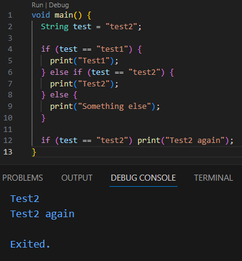

#### Langkah 3:
Tambahkan kode program berikut, lalu coba eksekusi (Run) kode Anda.
``` dart
String test = "true";
if (test) {
   print("Kebenaran");
}
```

Apa yang terjadi ? Jika terjadi error, silakan perbaiki namun tetap menggunakan if/else.
**Jawaban**

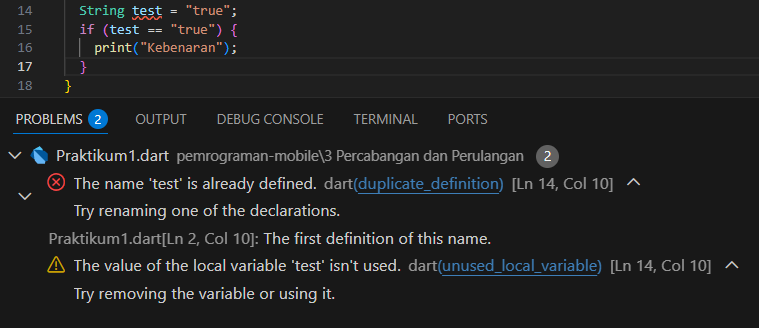

Programnya error saat dijalankan karena variabel test isinya berupa teks "true", tetapi langsung dipakai di dalam kondisi if (test). Di Dart, bagian dalam if harus benar-benar bernilai true atau false (boolean). Sedangkan "true" itu cuma string, bukan boolean. Karena tipe datanya tidak sesuai, maka muncul error dan program tidak bisa dijalankan.

**Perbaikan Kode:**
``` dart
void main() {
  String test = "test2";
  if (test == "test1") {
    print("Test1");
  } else if (test == "test2") {
    print("Test2");
  } else {
    print("Something else");
  }

  if (test == "test2") print("Test2 again");

  String test2 = "true";
  if (test2  == "true") {
    print("Kebenaran");
  }
}
```
**Hasil kode yang sudah diperbaiki**

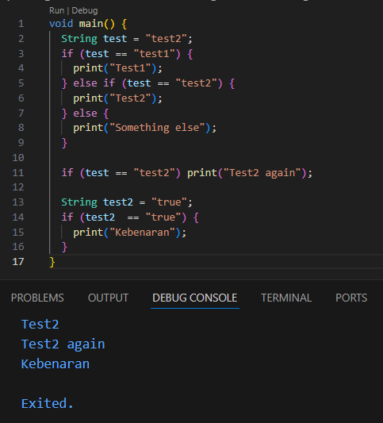

---

#### Praktikum 2: Menerapkan Perulangan "while" dan "do-while"

Selesaikan langkah-langkah praktikum berikut ini menggunakan DartPad di browser Anda.

#### Langkah 1:
Ketik atau salin kode program berikut ke dalam fungsi `main()`.

```dart
  while (counter < 33) {
    print(counter);
    counter++;
  }
```

#### Langkah 2:
Silakan coba eksekusi (Run) kode pada langkah 1 tersebut. Apa yang terjadi? Jelaskan! Lalu perbaiki jika terjadi error.

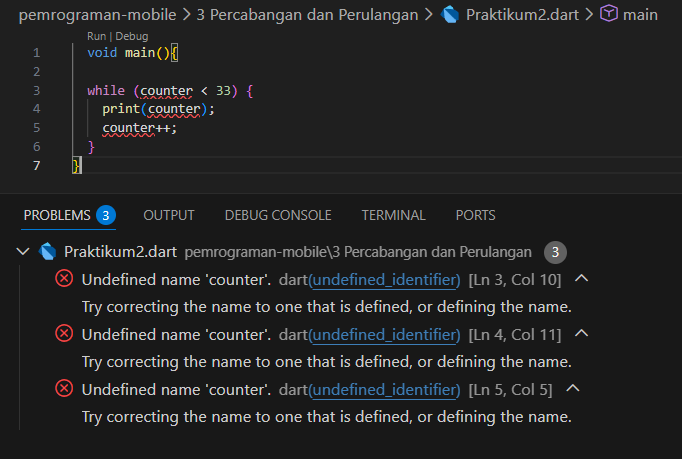

Ketika kode dijalankan (Run), program tidak bisa dieksekusi dan muncul error “Undefined name 'counter'”. Hal ini terjadi karena variabel counter digunakan di dalam perulangan while, tetapi belum pernah dideklarasikan sebelumnya. Dalam Dart, setiap variabel harus didefinisikan dulu sebelum dipakai. Karena counter tidak dikenali, maka muncul error.

**Perbaikan Kode:**
```dart
void main() {
  int counter = 10;

  while (counter < 33) {
    print(counter);
    counter++;
  }
}
```
**Hasil kode yang sudah diperbaiki**

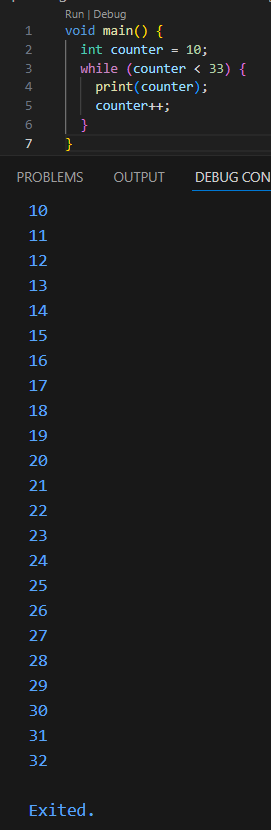

#### Langkah 3:
Tambahkan kode program berikut, lalu coba eksekusi (Run) kode Anda.

``` dart
do {
  print(counter);
  counter++;
} while (counter < 77);
```

Apa yang terjadi ? Jika terjadi error, silakan perbaiki namun tetap menggunakan do-while.

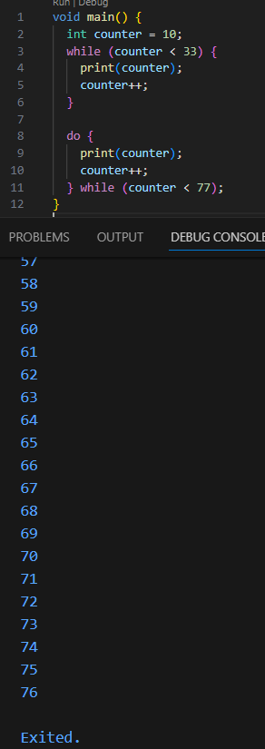

Tidak ada error, program berjalan normal sesuai logika perulangannya. Program mencetak angka dari 10 sampai 76 secara berurutan. Bagian 10–32 berasal dari while, dan 33–76 berasal dari do-while.

---

#### Praktikum 3: Menerapkan Perulangan "for" dan "break-continue"

Selesaikan langkah-langkah praktikum berikut ini menggunakan DartPad di browser Anda.

#### Langkah 1:
Ketik atau salin kode program berikut ke dalam fungsi main().

``` dart
for (Index = 10; index < 27; index) {
  print(Index);
}
```

#### Langkah 2:
Silakan coba eksekusi (Run) kode pada langkah 1 tersebut. Apa yang terjadi? Jelaskan! Lalu perbaiki jika terjadi error.

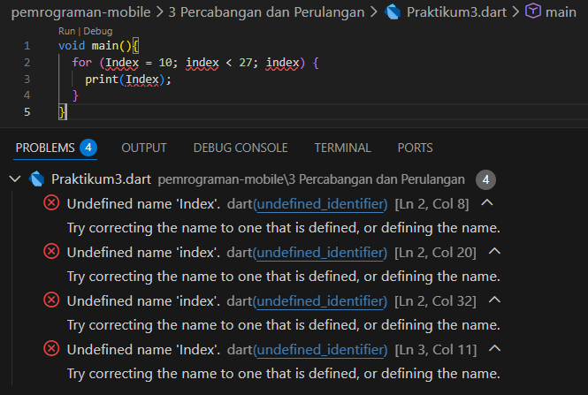

Saat kode dijalankan, program tidak bisa dieksekusi dan muncul error “Undefined name 'Index'” serta “Undefined name 'index'” pada bagian perulangan for. Hal ini terjadi karena variabel Index dan index digunakan tanpa dideklarasikan terlebih dahulu. Di dalam struktur for pada Dart, variabel perulangan harus langsung didefinisikan, misalnya dengan menuliskan tipe datanya (int).

**Perbaikan Kode:**
```dart
void main() {
  for (int index = 10; index < 27; index++) {
    print(index);
  }
}
```
**Hasil kode yang sudah diperbaiki**

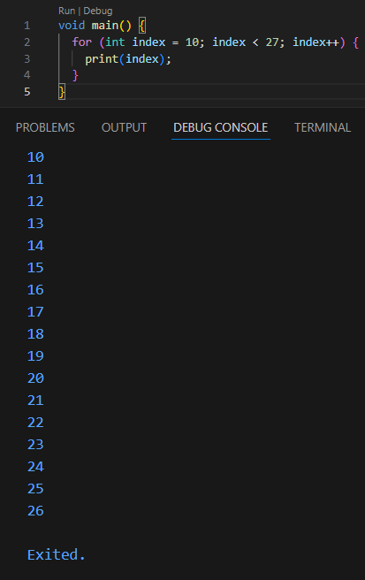

#### Langkah 3:
Tambahkan kode program berikut di dalam for-loop, lalu coba eksekusi (Run) kode Anda.
```dart
If (Index == 21) break;
Else If (index > 1 || index < 7) continue;
print(index);
```
Apa yang terjadi ? Jika terjadi error, silakan perbaiki namun tetap menggunakan for dan break-continue.

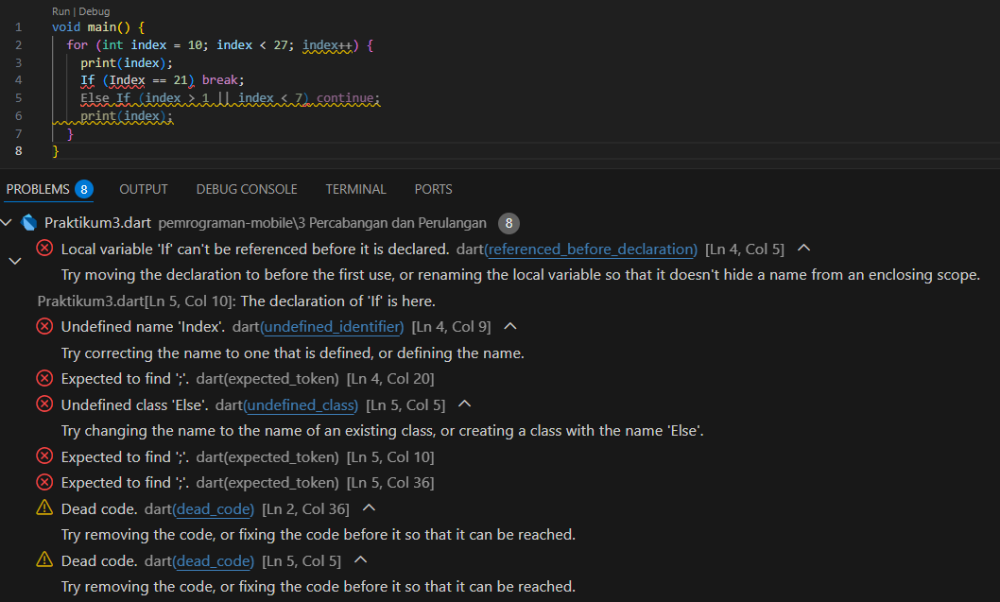

Program sebelumnya mengalami error karena penulisan keyword tidak sesuai, yaitu menggunakan If dan Else If (huruf besar), padahal di Dart harus ditulis if dan else if dengan huruf kecil. Selain itu, penggunaan Index dan index juga tidak konsisten, sedangkan Dart membedakan huruf besar dan kecil (case-sensitive). Akibatnya variabel dianggap berbeda dan muncul error.

**Perbaikan Kode**
```dart
void main() {
  for (int index = 10; index < 27; index++) {
    if (index == 21) break;
    else if (index > 1 || index < 7) continue;
    print(index);
  }
}
```
**Hasil kode yang sudah diperbaiki**

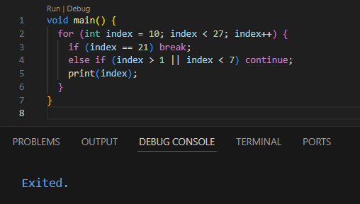

---

#### Tugas
Buatlah sebuah program yang dapat menampilkan bilangan prima dari angka 0 sampai 201 menggunakan Dart. Ketika bilangan prima ditemukan, maka tampilkan nama lengkap dan NIM Anda.

**Kode Program**
```dart
void main() {
  String nama = "Primayunita Putri Agustine";
  String nim = "244107060094";
  
  for (int i = 0; i <= 201; i++) {
    bool isPrima = true;
    if (i < 2) {
      isPrima = false;
    } else {
      for (int j = 2; j <= i ~/ 2; j++) {
        if (i % j == 0) {
          isPrima = false;
          break;
        }
      }
    }
    if (isPrima) {
      print("$i. $nama | $nim");
    } else {
      print("$i");
    }
  }
}
```

**Output**

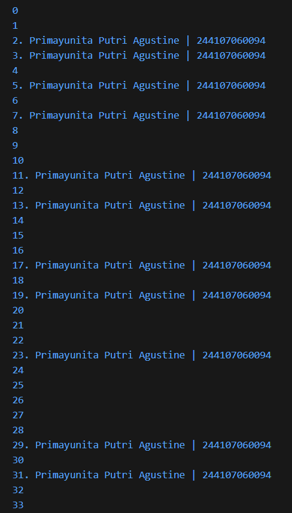
.png)

