# Laporan Praktikum #04 - Pemrograman Dasar Dart - Bag.3 (Collections dan Functions)

| Atribut | Keterangan                  |
| ------- | ----------                  |
| Nama    | Primayunita Putri Agustine  |
| NIM     | 244107060094                |
| Kelas   | SIB-2E                      |

---

### Praktikum 1: Eksperimen Tipe Data List

Selesaikan langkah-langkah praktikum berikut ini menggunakan VS Code atau Code Editor favorit Anda.

#### Langkah 1:
Ketik atau salin kode program berikut ke dalam `void main()`.
Code: 
```dart
var list = [1, 2, 3];
assert(list.length == 3);
assert(list[1] == 2);
print(list.length);
print(list[1]);

list[1] = 1;
assert(list[1] == 1);
print(list[1]);
```

#### Langkah 2:
Silakan coba eksekusi (Run) kode pada langkah 1 tersebut. Apa yang terjadi? Jelaskan!

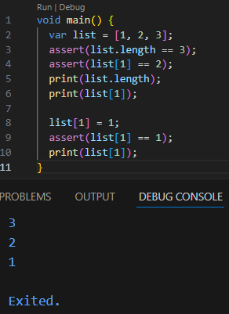

Program tersebut membuat sebuah list berisi angka [1, 2, 3], lalu menggunakan assert untuk memastikan bahwa panjang list adalah 3 dan nilai pada indeks ke-1 adalah 2. Setelah itu program menampilkan panjang list (3) dan nilai pada indeks ke-1 (2). Kemudian nilai pada indeks ke-1 diubah dari 2 menjadi 1, lalu dicek kembali dengan assert untuk memastikan nilainya sudah 1, dan akhirnya program menampilkan nilai tersebut sehingga output yang dihasilkan adalah 3, 2, dan 1.

#### Langkah 3:
Ubah kode pada langkah 1 menjadi variabel final yang mempunyai index = 5 dengan default value = null. Isilah nama dan NIM Anda pada elemen index ke-1 dan ke-2. Lalu print dan capture hasilnya.

Apa yang terjadi ? Jika terjadi error, silakan perbaiki.

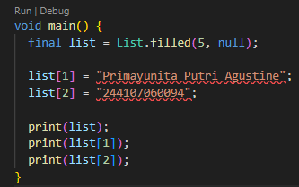

**Jawaban**

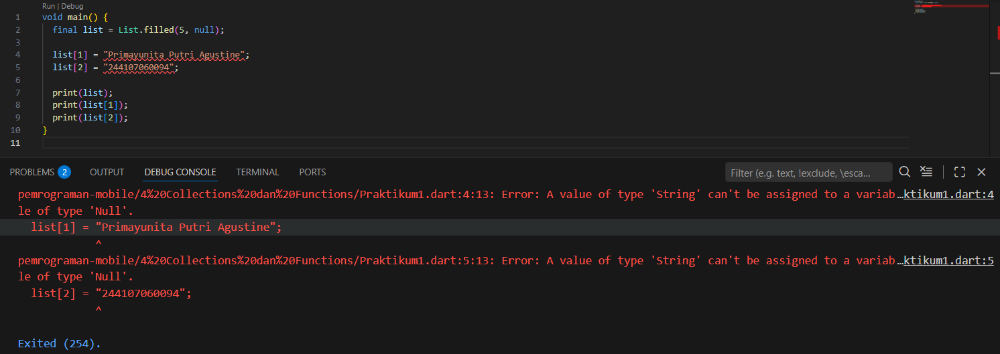

Error terjadi karena list dibuat dengan nilai awal null tanpa menentukan tipe datanya. Hal ini membuat Dart menganggap list tersebut hanya bisa berisi null. Saat program mencoba memasukkan data bertipe String, muncul error karena tipe datanya tidak sesuai.

**Perbaikan Kode:**
``` dart
void main() {
  List<String?> data = List.filled(5, null);

  data[1] = "Primayunita Putri Agustine";
  data[2] = "244107060094";

  print(data);
  print(data[1]);
  print(data[2]);
}
```
**Hasil kode yang sudah diperbaiki**

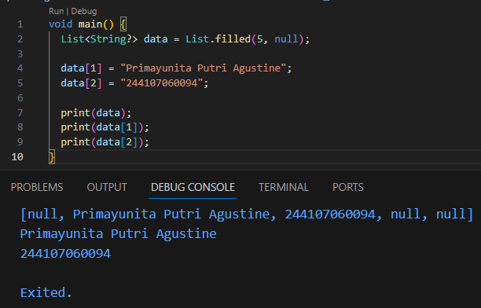

---

#### Praktikum 2: Eksperimen Tipe Data Set

Selesaikan langkah-langkah praktikum berikut ini menggunakan VS Code atau Code Editor favorit Anda.

#### Langkah 1:
Ketik atau salin kode program berikut ke dalam fungsi `main()`.

```dart
var halogens = {'fluorine', 'chlorine', 'bromine', 'iodine', 'astatine'};
print(halogens);
```

#### Langkah 2:
Silakan coba eksekusi (Run) kode pada langkah 1 tersebut. Apa yang terjadi? Jelaskan! Lalu perbaiki jika terjadi error.

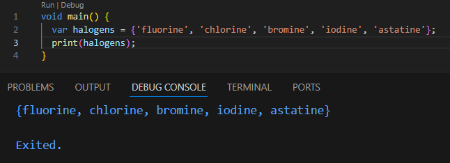

Setelah kode dijalankan, program berhasil menampilkan isi variabel halogens ke layar. Variabel tersebut berisi set yang terdiri dari beberapa nama unsur halogen yaitu fluorine, chlorine, bromine, iodine, dan astatine. Karena menggunakan kurung kurawal {}, Dart mengenalinya sebagai Set, sehingga saat di-print hasilnya ditampilkan dalam bentuk {fluorine, chlorine, bromine, iodine, astatine} tanpa terjadi error.

#### Langkah 3:
Tambahkan kode program berikut, lalu coba eksekusi (Run) kode Anda.

``` dart
var names1 = <String>{};
Set<String> names2 = {}; // This works, too.
var names3 = {}; // Creates a map, not a set.

print(names1);
print(names2);
print(names3);
```

Apa yang terjadi ? Jika terjadi error, silakan perbaiki namun tetap menggunakan ketiga variabel tersebut. Tambahkan elemen nama dan NIM Anda pada kedua variabel Set tersebut dengan dua fungsi berbeda yaitu .add() dan .addAll(). Untuk variabel Map dihapus, nanti kita coba di praktikum selanjutnya.

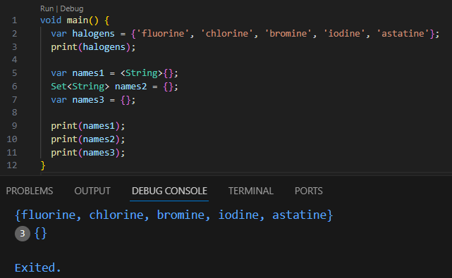

Pada kode tersebut tidak terjadi error. Variabel names1 dan names2 dibuat sebagai Set kosong, sedangkan names3 sebenarnya dibuat sebagai Map kosong karena menggunakan {} tanpa tipe data. Karena pada praktikum ini yang digunakan hanya Set, maka variabel names3 (Map) dihapus.

**Perbaikan kode:**
```dart
void main() {
  var halogens = {'fluorine', 'chlorine', 'bromine', 'iodine', 'astatine'};
  print(halogens);

  var names1 = <String>{};
  Set<String> names2 = {};

  names1.add("Primayunita Putri Agustine");
  names1.add("244107060094")

  names2.addAll({"Primayunita Putri Agustine", "244107060094"});

  print(names1);
  print(names2);
}
```

**Hasil kode yang sudah diperbaiki**

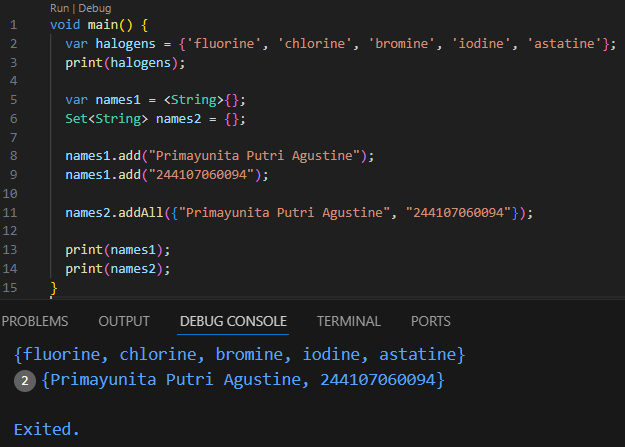

---

#### Praktikum 3: Eksperimen Tipe Data Maps

Selesaikan langkah-langkah praktikum berikut ini menggunakan VS Code atau Code Editor favorit Anda.

#### Langkah 1:
Ketik atau salin kode program berikut ke dalam fungsi main().

``` dart
var gifts = {
  // Key:    Value
  'first': 'partridge',
  'second': 'turtledoves',
  'fifth': 1
};

var nobleGases = {
  2: 'helium',
  10: 'neon',
  18: 2,
};

print(gifts);
print(nobleGases);
```

#### Langkah 2:
Silakan coba eksekusi (Run) kode pada langkah 1 tersebut. Apa yang terjadi? Jelaskan! Lalu perbaiki jika terjadi error.

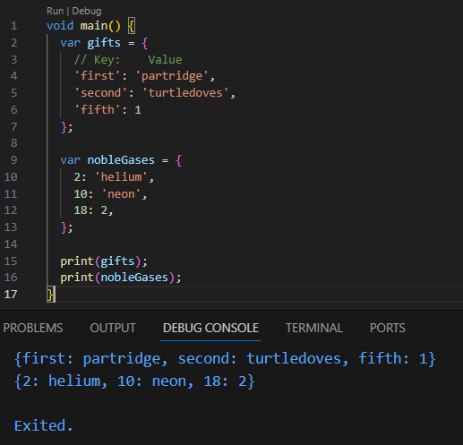

Setelah program dijalankan, fungsi print() menampilkan seluruh isi Map ke layar sehingga output yang muncul adalah semua pasangan key dan value yang tersimpan di dalam kedua Map tersebut. Program berjalan tanpa error karena penulisan Map sudah benar.

#### Langkah 3:
Tambahkan kode program berikut di dalam for-loop, lalu coba eksekusi (Run) kode Anda.
```dart
var mhs1 = Map<String, String>();
gifts['first'] = 'partridge';
gifts['second'] = 'turtledoves';
gifts['fifth'] = 'golden rings';

var mhs2 = Map<int, String>();
nobleGases[2] = 'helium';
nobleGases[10] = 'neon';
nobleGases[18] = 'argon';
```
Apa yang terjadi ? Jika terjadi error, silakan perbaiki.

Tambahkan elemen nama dan NIM Anda pada tiap variabel di atas (gifts, nobleGases, mhs1, dan mhs2). Dokumentasikan hasilnya dan buat laporannya!

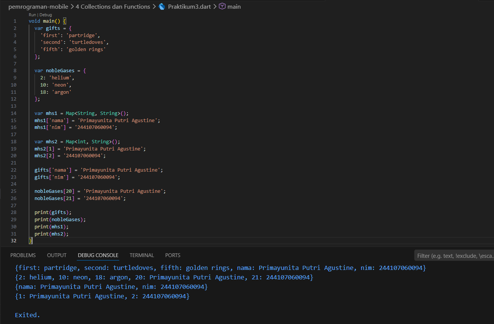

Program berhasil dijalankan dan menampilkan data dari setiap Map. Elemen nama dan NIM telah ditambahkan ke semua variabel Map sesuai dengan tipe key dan value yang digunakan.

---

### Praktikum 4: Eksperimen Tipe Data List: Spread dan Control-flow Operators

Selesaikan langkah-langkah praktikum berikut ini menggunakan VS Code atau Code Editor favorit Anda.

#### Langkah 1:
Ketik atau salin kode program berikut ke dalam fungsi main().

``` dart
var list = [1, 2, 3];
var list2 = [0, ...list];
print(list1);
print(list2);
print(list2.length);
```

#### Langkah 2:
Silakan coba eksekusi (Run) kode pada langkah 1 tersebut. Apa yang terjadi? Jelaskan! Lalu perbaiki jika terjadi error.

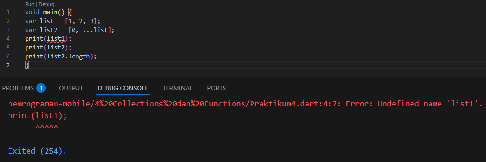

Error terjadi karena program memanggil variabel list1, padahal variabel yang dibuat adalah list. Akibatnya Dart menampilkan pesan Undefined name 'list1' karena variabel tersebut tidak ada. Error dapat diperbaiki dengan mengganti print(list1); menjadi print(list);.

**Perbaikan Kode:**
``` dart
void main() {
  var list = [1, 2, 3];
  var list2 = [0, ...list];

  print(list);
  print(list2);
  print(list2.length);
}
```
**Hasil kode yang sudah diperbaiki**

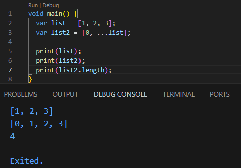

#### Langkah 3:
Tambahkan kode program berikut di dalam for-loop, lalu coba eksekusi (Run) kode Anda.
```dart
list1 = [1, 2, null];
print(list1);
var list3 = [0, ...?list1];
print(list3.length);
```
Apa yang terjadi ? Jika terjadi error, silakan perbaiki.

Tambahkan variabel list berisi NIM Anda menggunakan Spread Operators. Dokumentasikan hasilnya dan buat laporannya!

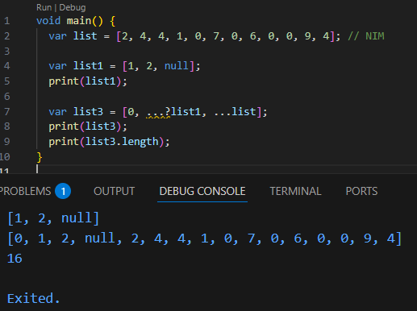

Program berhasil dijalankan dengan menggunakan null-aware spread operator (...?) sehingga nilai null tidak menyebabkan error. Data dari list1 dan list yang berisi NIM berhasil digabungkan ke dalam list3.

### Langkah 4:
Tambahkan kode program berikut, lalu coba eksekusi (Run) kode Anda.
```dart
var nav = ['Home', 'Furniture', 'Plants', if (promoActive) 'Outlet'];
print(nav);
```
Apa yang terjadi ? Jika terjadi error, silakan perbaiki. Tunjukkan hasilnya jika variabel promoActive ketika true dan false.

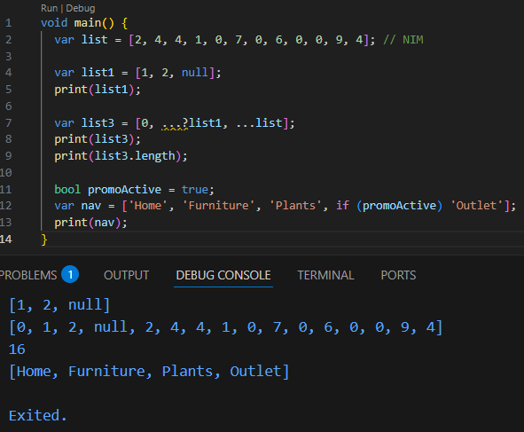

Program dapat dijalankan tanpa error dan semua hasil akan ditampilkan menggunakan print().

### Langkah 5 :
Tambahkan kode program berikut, lalu coba eksekusi (Run) kode Anda.
```dart
var nav2 = ['Home', 'Furniture', 'Plants', if (login case 'Manager') 'Inventory'];
print(nav2);
```
Apa yang terjadi ? Jika terjadi error, silakan perbaiki. Tunjukkan hasilnya jika variabel login mempunyai kondisi lain.

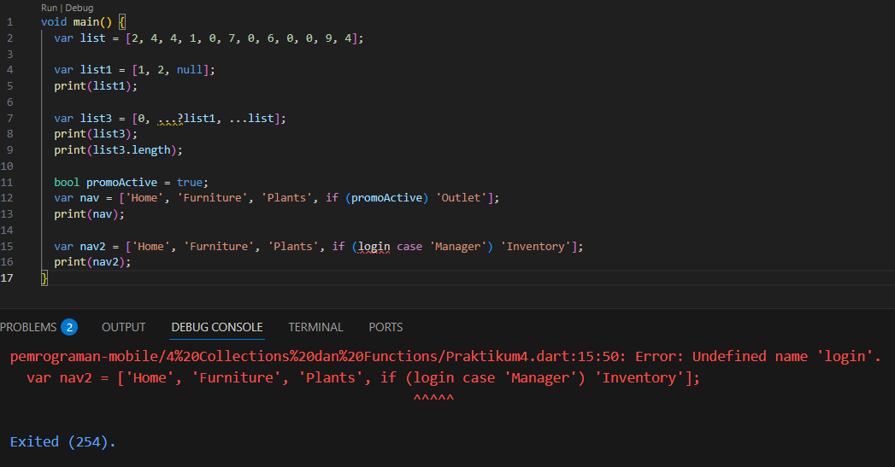

Kode tersebut error karena variabel login belum dideklarasikan. Selain itu, sintaks if (login case 'Manager') membutuhkan nilai pada variabel login.

**Perbaikan kode:**
```dart
void main() {
  var list = [2, 4, 4, 1, 0, 7, 0, 6, 0, 0, 9, 4]; // NIM

  var list1 = [1, 2, null];
  print(list1);

  var list3 = [0, ...?list1, ...list];
  print(list3);
  print(list3.length);

  bool promoActive = true;
  var nav = ['Home', 'Furniture', 'Plants', if (promoActive) 'Outlet'];
  print(nav);

  String login = 'Manager';
  var nav2 = ['Home', 'Furniture', 'Plants', if (login case 'Manager') 'Inventory'];
  print(nav2);
}
```

**Hasil kode yang sudah diperbaiki**

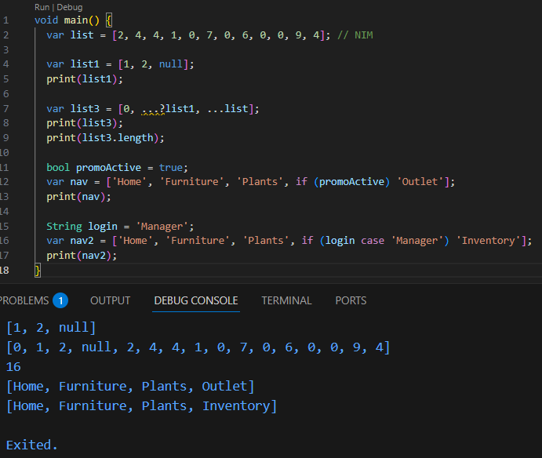

### Langkah 6 :
Tambahkan kode program berikut, lalu coba eksekusi (Run) kode Anda.
```dart
var listOfInts = [1, 2, 3];
var listOfStrings = ['#0', for (var i in listOfInts) '#$i'];
assert(listOfStrings[1] == '#1');
print(listOfStrings);
```
Apa yang terjadi ? Jika terjadi error, silakan perbaiki. Jelaskan manfaat Collection For dan dokumentasikan hasilnya.

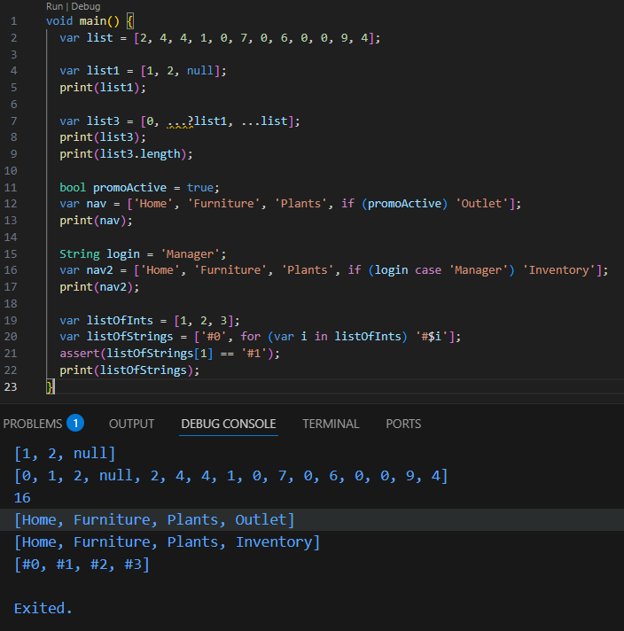

Kode tersebut berjalan tanpa error. Program membuat listOfInts yang berisi angka 1, 2, dan 3, kemudian menggunakan Collection For untuk membuat listOfStrings. Setiap angka pada listOfInts akan diubah menjadi string dengan tanda # di depannya sehingga menghasilkan #1, #2, dan #3.

---

### Praktikum 5: Eksperimen Tipe Data Records
Selesaikan langkah-langkah praktikum berikut ini menggunakan VS Code atau Code Editor favorit Anda.

#### Langkah 1:
Ketik atau salin kode program berikut ke dalam fungsi main().

``` dart
var record = ('first', a: 2, b: true, 'last');
print(record)
```

#### Langkah 2:
Silakan coba eksekusi (Run) kode pada langkah 1 tersebut. Apa yang terjadi? Jelaskan! Lalu perbaiki jika terjadi error.

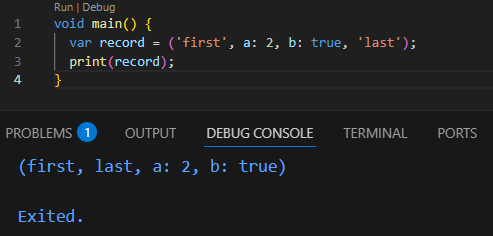

Kode tersebut membuat sebuah record yang berisi beberapa data dengan positional field dan named field. Saat program dijalankan, seluruh isi record ditampilkan ke layar menggunakan print(). Program berjalan dengan baik tanpa menghasilkan error.

#### Langkah 3:
Tambahkan kode program berikut di luar scope void main(), lalu coba eksekusi (Run) kode Anda.
```dart
(int, int) tukar((int, int) record) {
  var (a, b) = record;
  return (b, a);
}
```
Apa yang terjadi ? Jika terjadi error, silakan perbaiki. Gunakan fungsi tukar() di dalam main() sehingga tampak jelas proses pertukaran value field di dalam Records.

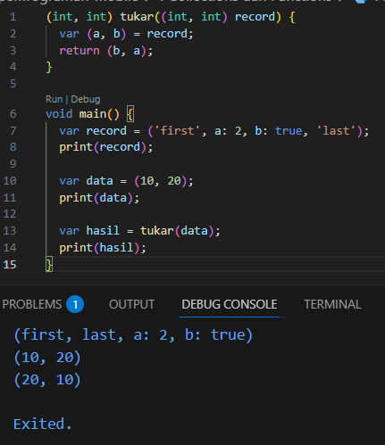

Kode tersebut menambahkan fungsi tukar() yang digunakan untuk menukar posisi dua nilai dalam record. Fungsi ini mengambil dua nilai dari record, lalu mengembalikannya dengan urutan yang dibalik. Saat dijalankan di dalam main(), terlihat bahwa nilai record yang awalnya (10, 20) berubah menjadi (20, 10).

### Langkah 4:
Tambahkan kode program berikut di dalam scope void main(), lalu coba eksekusi (Run) kode Anda.
```dart
// Record type annotation in a variable declaration:
(String, int) mahasiswa;
print(mahasiswa);
```
Apa yang terjadi ? Jika terjadi error, silakan perbaiki. Inisialisasi field nama dan NIM Anda pada variabel record mahasiswa di atas. Dokumentasikan hasilnya dan buat laporannya!

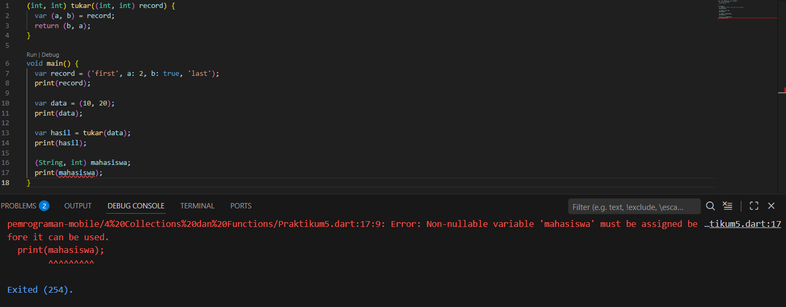

Kode tersebut error karena variabel mahasiswa sudah dideklarasikan tetapi belum diinisialisasi, lalu langsung dipanggil dengan print(mahasiswa). Pada Dart dengan null safety, variabel harus diberi nilai terlebih dahulu sebelum digunakan.

**Perbaikan kode:**
```dart
(int, int) tukar((int, int) record) {
  var (a, b) = record;
  return (b, a);
}

void main() {
  var record = ('first', a: 2, b: true, 'last');
  print(record);

  var data = (10, 20);
  print(data);

  var hasil = tukar(data);
  print(hasil);

  (String, int) mahasiswa;

  mahasiswa = ('Primayunita Putri Agustine', 244107060094);

  print(mahasiswa);
}
```

**Hasil kode yang sudah diperbaiki**

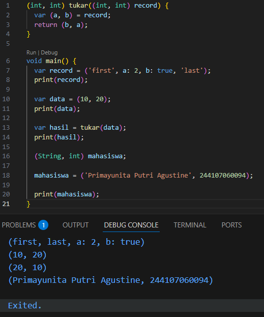

### Langkah 5 :
Tambahkan kode program berikut di dalam scope void main(), lalu coba eksekusi (Run) kode Anda.
```dart
var mahasiswa2 = ('first', a: 2, b: true, 'last');

print(mahasiswa2.$1); // Prints 'first'
print(mahasiswa2.a); // Prints 2
print(mahasiswa2.b); // Prints true
print(mahasiswa2.$2); // Prints 'last'
```
Apa yang terjadi ? Jika terjadi error, silakan perbaiki. Gantilah salah satu isi record dengan nama dan NIM Anda, lalu dokumentasikan hasilnya dan buat laporannya!

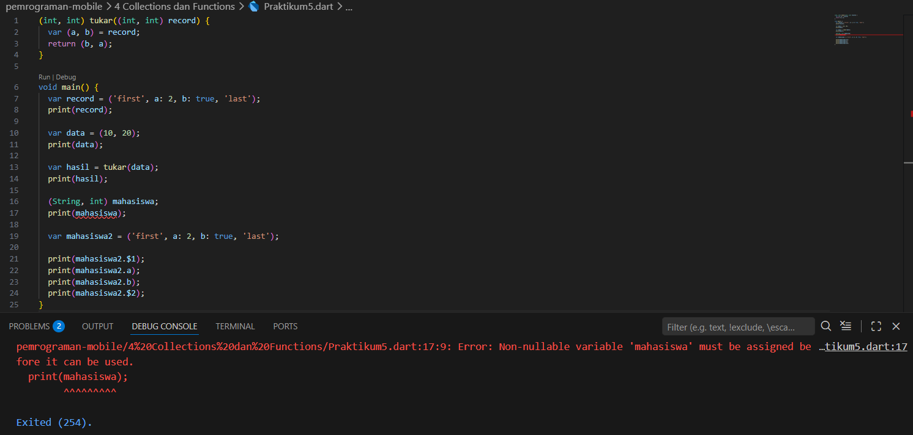

Kode tersebut menghasilkan error karena variabel mahasiswa sudah dideklarasikan tetapi belum diberi nilai, lalu langsung dipanggil dengan print(mahasiswa). Pada Dart dengan null safety, variabel harus diinisialisasi terlebih dahulu sebelum digunakan sehingga program tidak dapat dijalankan.

**Perbaikan kode:**
```dart
(int, int) tukar((int, int) record) {
  var (a, b) = record;
  return (b, a);
}

void main() {
  var record = ('first', a: 2, b: true, 'last');
  print(record);

  var data = (10, 20);
  print(data);

  var hasil = tukar(data);
  print(hasil);

  (String, int) mahasiswa;
  mahasiswa = ('Primayunita Putri Agustine', 244107060094);
  print(mahasiswa);

  var mahasiswa2 = ('Primayunita Putri Agustine', a: 2, b: true, '244107060094');

  print(mahasiswa2.$1); 
  print(mahasiswa2.a);
  print(mahasiswa2.b);
  print(mahasiswa2.$2); 
}
```

**Hasil kode yang sudah diperbaiki**

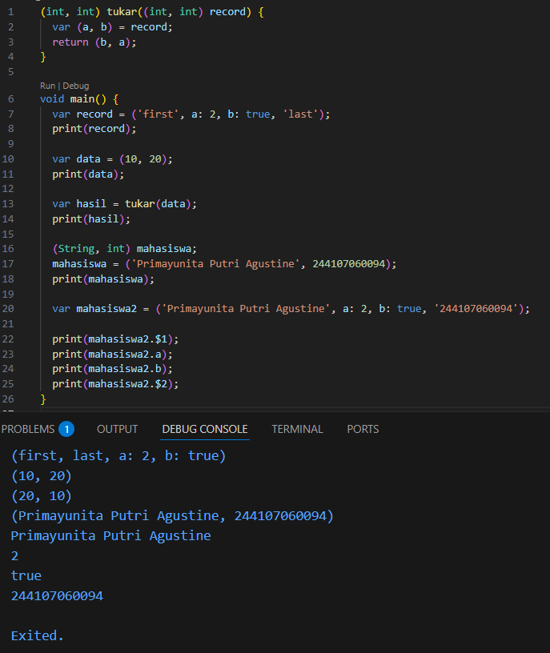

---

#### Tugas Praktikum

## Soal 1

Silakan selesaikan Praktikum 1 sampai 5, lalu dokumentasikan berupa screenshot hasil pekerjaan Anda beserta penjelasannya!

## Soal 2

Jelaskan yang dimaksud Functions dalam bahasa Dart!

## Jawaban :
Function adalah kumpulan kode yang dibuat untuk menjalankan suatu tugas tertentu. Function membantu agar program lebih rapi dan kode tidak perlu ditulis berulang-ulang. Function dapat dipanggil kapan saja saat dibutuhkan.

## Soal 3

Jelaskan jenis-jenis parameter di Functions beserta contoh sintaksnya!

## Jawaban :

**1.Required Parameter**

  Parameter yang harus diisi ketika function dipanggil.

  **Contoh :**
  ```dart
  void sapa(String nama) {
  print("Halo $nama");
  }
  ```
**2. Optional Positional Parameter**

  Parameter yang boleh diisi atau tidak dan ditulis menggunakan tanda [].

  **Contoh :**
  ```dart
  void sapa(String nama, [String? pesan]) {
  print("$nama $pesan");
  }
  ```
**3. Named Parameter**

  Parameter yang dipanggil menggunakan nama parameternya dan ditulis dengan {}.

  **Contoh :**
  ``` dart
  void sapa({String? nama, int? umur}) {
  print("$nama berumur $umur");
  }
  ```
**4. Default Parameter**

  Parameter yang memiliki nilai awal (default) jika tidak diisi.

  **Contoh :**
  ```dart
  void sapa({String nama = "User"}) {
  print("Halo $nama");
  }
  ```

## Soal 4

Jelaskan maksud Functions sebagai first-class objects beserta contoh sintaknya!

## Jawaban : 
Di Dart, function bisa disimpan dalam variabel, dikirim sebagai parameter, atau dikembalikan dari function lain. Artinya function diperlakukan seperti data biasa.

**Contoh :** 
```dart
void halo() {
  print("Halo Dunia");
}

void main() {
  var fungsi = halo;
  fungsi();
}
```

## Soal 5

Apa itu Anonymous Functions? Jelaskan dan berikan contohnya!

## Jawaban :
Anonymous function adalah function yang tidak memiliki nama dan biasanya digunakan langsung pada suatu proses.

**Contoh :** 
```dart
var daftar = ['A', 'B', 'C'];

daftar.forEach((item) {
  print(item);
});
```

## Soal 6

Jelaskan perbedaan Lexical scope dan Lexical closures! Berikan contohnya!

## Jawaban : 
Lexical Scope adalah aturan bahwa variabel hanya bisa digunakan di dalam tempat variabel tersebut dibuat.

**Contoh :**
```dart
void main() {
  var nama = "Primayunita";

  void tampil() {
    print(nama);
  }

  tampil();
}
```

Lexical Closure adalah kondisi ketika sebuah function masih bisa menggunakan variabel dari luar function tersebut.

**Contoh :**
```dart
Function hitung() {
  int nilai = 0;

  return () {
    nilai++;
    print(nilai);
  };
}
```

## Soal 7

Jelaskan dengan contoh cara membuat return multiple value di Functions!

## Jawaban :
Di Dart, sebuah function bisa mengembalikan lebih dari satu nilai menggunakan Record.

**Contoh :**
```dart
(String, int) dataMahasiswa() {
  return ("Primayunita", 19);
}

void main() {
  var data = dataMahasiswa();
  print(data.$1);
  print(data.$2);
}
```
Function tersebut mengembalikan dua nilai sekaligus, yaitu nama dan umur.