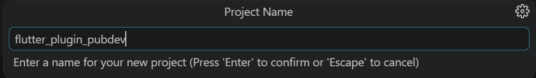
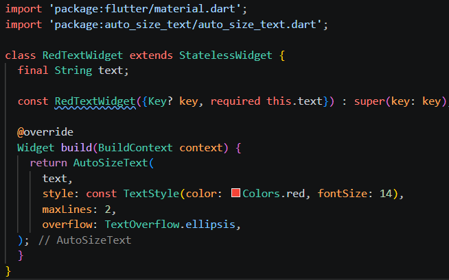

# Laporan Praktikum #07 - Manajemen Plugin

## Identitas Mahasiswa

| Atribut | Nilai                       |
| ------- | -----                       |
| Nama    | Primayunita Putri Agustine  |
| NIM     | 244107060094                |
| Kelas   | SIB-2E                      |

[LINK REPOSITORY KODE PRAKTIKUM](https://github.com/Primayunita/flutter_plugin_pubdev.git)

---

## Praktikum Menerapkan Plugin di Project Flutter

### Langkah 1: Buat Project Baru

Buatlah sebuah project flutter baru dengan nama flutter_plugin_pubdev. Lalu jadikan repository di GitHub Anda dengan nama flutter_plugin_pubdev.

### Langkah 2: Menambahkan Plugin

Tambahkan plugin auto_size_text menggunakan perintah berikut di terminal

.png)

Jika berhasil, maka akan tampil nama plugin beserta versinya di file pubspec.yaml pada bagian dependencies.

.png)

### Langkah 3: Buat file red_text_widget.dart

Buat file baru bernama red_text_widget.dart di dalam folder lib lalu isi kode seperti berikut.

.png)

.png)

### Langkah 4: Tambah Widget AutoSizeText

Masih di file red_text_widget.dart, untuk menggunakan plugin auto_size_text, ubahlah kode return Container() menjadi seperti berikut.

.png)

Setelah Anda menambahkan kode di atas, Anda akan mendapatkan info error. Mengapa demikian? Jelaskan dalam laporan praktikum Anda!

*Jawab:*

Error terjadi karena AutoSizeText belum di-import, jadi widget tidak dikenali. Solusinya, tambahkan import 'package:auto_size_text/auto_size_text.dart'; di bagian atas file.

**Perbaikan kode:**

.png)

Kode masih mengalami error karena variabel text di dalam build belum didefinisikan pada kelas RedTextWidget. Perbaikannya dilakukan dengan menambahkan final String text; lalu memasukkannya ke konstruktor supaya widget bisa menerima input teks. Selain itu, penulisan Key diperbarui menjadi super.key agar sesuai dengan sintaks Dart terbaru.

### Langkah 5: Buat Variabel text dan parameter di constructor

Tambahkan variabel text dan parameter di constructor seperti berikut.

### Langkah 6: Tambahkan widget di main.dart

Buka file main.dart lalu tambahkan di dalam children: pada class _MyHomePageState

.png)

.png)

Run aplikasi tersebut dengan tekan F5, maka hasilnya akan seperti berikut.

.png)

## TUGAS PRAKTIKUM

### 1. Selesaikan Praktikum tersebut, lalu dokumentasikan dan push ke repository Anda berupa screenshot hasil pekerjaan beserta penjelasannya di file README.md!

### 2. Jelaskan maksud dari langkah 2 pada praktikum tersebut!

*Jawab:*

Langkah 2 bertujuan menambahkan package auto_size_text ke project Flutter agar widget AutoSizeText bisa digunakan. Perintah tersebut otomatis memasukkan plugin ke pubspec.yaml pada bagian dependencies.

### 3. Jelaskan maksud dari langkah 5 pada praktikum tersebut!

*Jawab:*

Langkah 5 bertujuan agar RedTextWidget bisa menerima teks dari luar melalui variabel text. Constructor required this.text memastikan teks wajib diisi saat widget dibuat. Jadi, widget bisa digunakan secara dinamis dengan isi teks yang berbeda.

### 4. Pada langkah 6 terdapat dua widget yang ditambahkan, jelaskan fungsi dan perbedaannya!

*Jawab:*

Pada langkah 6, RedTextWidget dan Text sama-sama digunakan untuk menampilkan teks. Bedanya, RedTextWidget adalah widget custom yang sudah memiliki style tertentu (misalnya warna merah) sehingga lebih efisien untuk penggunaan berulang. Sedangkan Text adalah widget bawaan Flutter yang lebih fleksibel, tetapi perlu pengaturan tambahan untuk styling.

### 5. Jelaskan maksud dari tiap parameter yang ada di dalam plugin auto_size_text berdasarkan tautan pada dokumentasi https://pub.dev/documentation/auto_size_text/latest/ 

*Jawab:*

- text: Berisi kalimat atau teks yang ingin ditampilkan di layar.
- style: Digunakan untuk mengatur tampilan teks, seperti warna, ukuran awal, dan jenis font.
- maxLines: Menentukan jumlah maksimal baris yang bisa digunakan oleh teks.
- minFontSize: Batas ukuran font paling kecil saat teks diperkecil agar tetap muat.
- maxFontSize: Batas ukuran font paling besar yang bisa digunakan.
- stepGranularity: Mengatur besar kecilnya perubahan ukuran font saat proses penyesuaian berlangsung.
- presetFontSizes: Kumpulan ukuran font tertentu yang akan dicoba satu per satu untuk menemukan yang paling sesuai.
- group: Menghubungkan beberapa teks agar memiliki ukuran font yang sama.
- textAlign: Mengatur posisi teks, seperti rata kiri, tengah, atau kanan.
- textDirection: Menentukan arah penulisan teks (dari kiri ke kanan atau sebaliknya).
- overflow: Mengatur apa yang terjadi jika teks melebihi ruang, misalnya dipotong atau diberi tanda "...".
- softWrap: Menentukan apakah teks boleh otomatis pindah ke baris berikutnya atau tidak.

### 6. Kumpulkan laporan praktikum Anda berupa link repository GitHub kepada dosen!